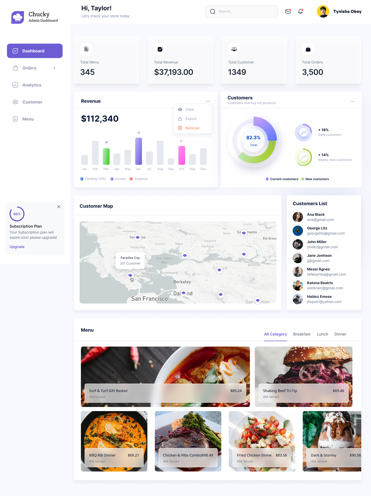

**Recreated Design**

This is a fully responsive implementation of the figma design using React, Tailwind CSS, and Mapbox GL.

**Getting Started**

To get started with the project, follow these steps:

1. Clone the repository: `git clone https://github.com/inth3wild/frontend-developer-assessment.git`
2. Navigate to project directory:
   - windows: `cd Recreated\ Design`
   - linux/unix: `cd "Recreated Design"`
3. Install dependencies: `npm install`
4. Start the development server: `npm run dev`

**Project Structure**

The project is structured as follows:

- `src/`: contains the source code for the project
  - `components/`: contains reusable components
  - `context/`: contains context providers and hooks
  - `utils/`: contains utility functions and helpers
- `public/`: contains static assets and the HTML file
- `tailwind.config.js`: contains the configuration for Tailwind CSS
- `postcss.config.js`: contains the configuration for PostCSS
- `vite.config.js`: contains the configuration for Vite

**Available Scripts**

In the project directory, you can run:

- `npm run dev`: starts the development server
- `npm run build`: builds the project for production
- `npm run lint`: runs the linter
- `npm run preview`: starts the production server

**Dependencies**

The project depends on the following packages:

- `@radix-ui/react-dropdown-menu`
- `@radix-ui/react-select`
- `class-variance-authority`
- `clsx`
- `lucide-react`
- `mapbox-gl`
- `motion`
- `react`
- `react-dom`
- `react-map-gl`
- `react-router-dom`
- `recharts`
- `tailwind-merge`
- `tailwindcss-animate`
- `vite-tsconfig-paths`

**Contributing**

Contributions are welcome! If you find any issues or have suggestions for improvements, please open an issue or submit a pull request.
